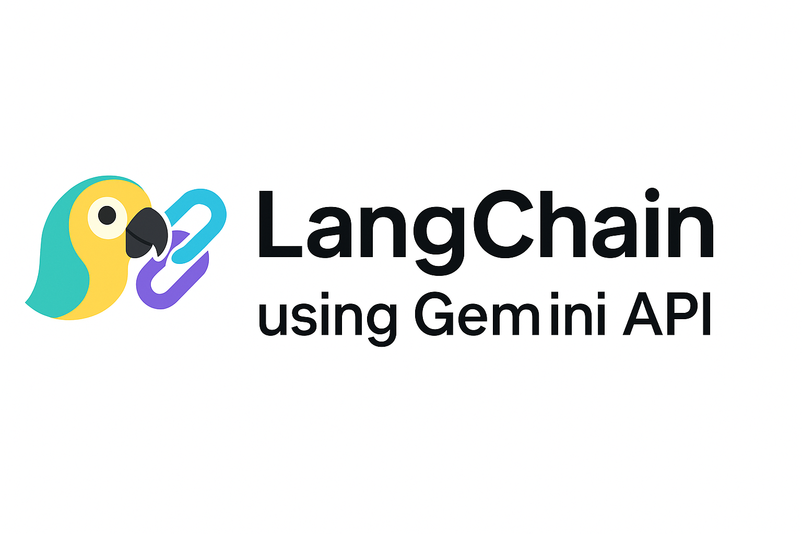

  

# LangChain + Google Gemini Learning Journey

This repository documents my **step-by-step learning path** for mastering the [LangChain](https://www.langchain.com/) framework, with **Google Gemini** as the LLM backend.  
It is designed as a reproducible set of **Colab/Jupyter notebooks**, progressing from fundamentals to an **end-to-end RAG Agent Capstone Project**.

---

## 📚 Lessons Overview

| #  | Lesson | Key Concepts | 
|----|--------|--------------|
| 1  | Intro to LangChain & Gemini Setup | API setup, first LLM call | 
| 2  | Prompt Templates | Variables, `.format()`, chaining with model |
| 3  | LLM Chains | `LLMChain`, combining prompts and models | 
| 4  | Memory in Chains | `ConversationSummaryMemory` | 
| 5  | Sequential Chains | `SimpleSequentialChain`, multi-step workflows | 
| 6  | Agents & Tools | `Tool`, `StructuredTool`, Zero-shot agents |
| 7  | Tool vs Structured Tool | Pydantic schemas, typed arguments | 
| 8  | Document Loading & Splitting | `TextLoader`, `PyPDFLoader`, `WebBaseLoader` | 
| 9  | Embeddings & FAISS Vector Store | `GoogleGenerativeAIEmbeddings`, `FAISS` search |
| 10 | Retrieval-Augmented Generation | Retriever + Prompt + LLM | 
| 11 | **Capstone: RAG Agent** | Custom knowledge base, tool integration | 

---

## 🛠️ Tech Stack

- **LLM:** Google Gemini (via `langchain_google_genai`)
- **Framework:** LangChain
- **Vector Store:** FAISS
- **Document Processing:** LangChain Document Loaders, RecursiveCharacterTextSplitter
- **Environment:** Google Colab / Jupyter
- **Languages:** Python 3.11

---

## 🚀 Running the Notebooks
1. Clone the repo
2. Open in Google Colab or Jupyter
3. Add your `GEMINI_API_KEY` as an environment variable
4. Run the notebooks in order — each lesson builds on the previous

---

## ✏️ Author
[Sudeep Kurian](https://www.linkedin.com/in/sudeep-kurian-75721614b) 
---
